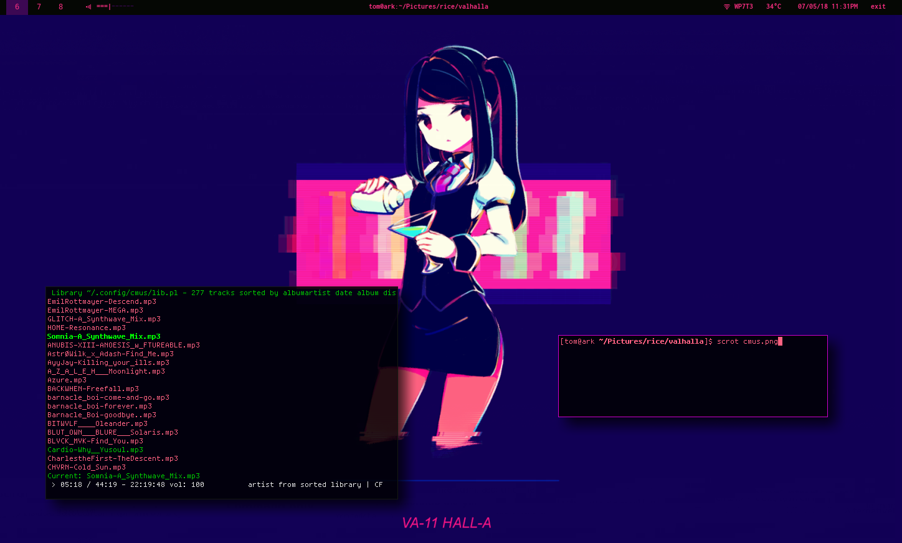
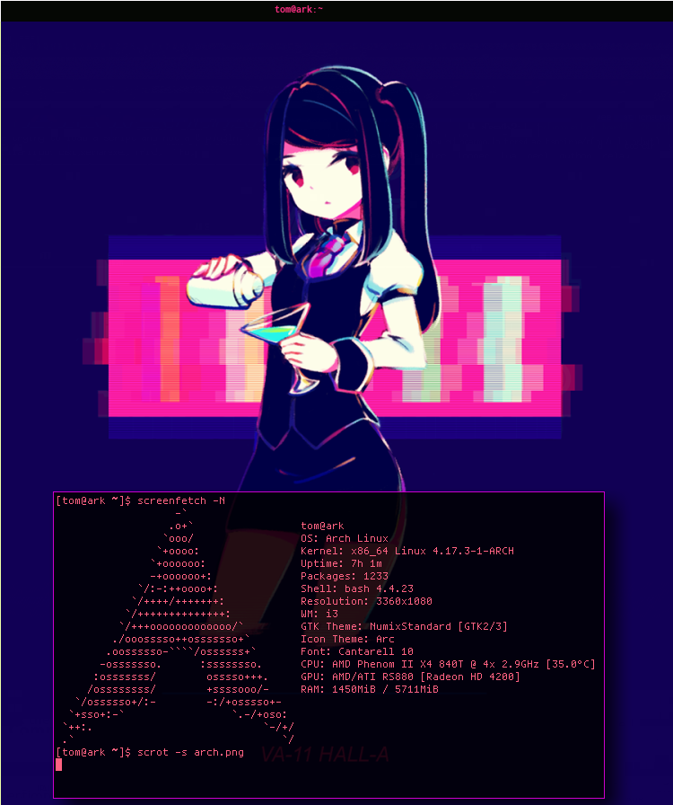
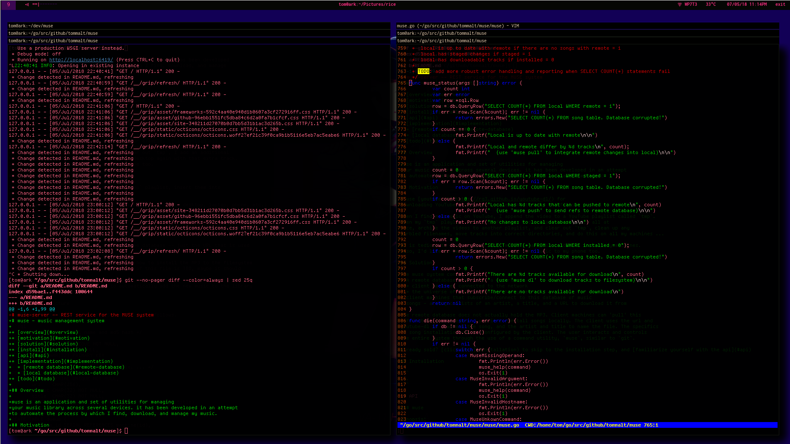
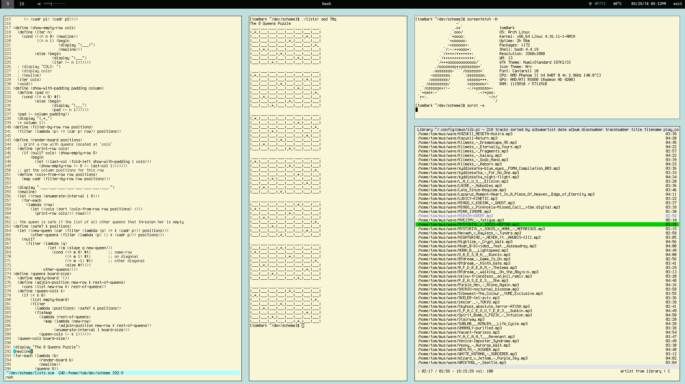
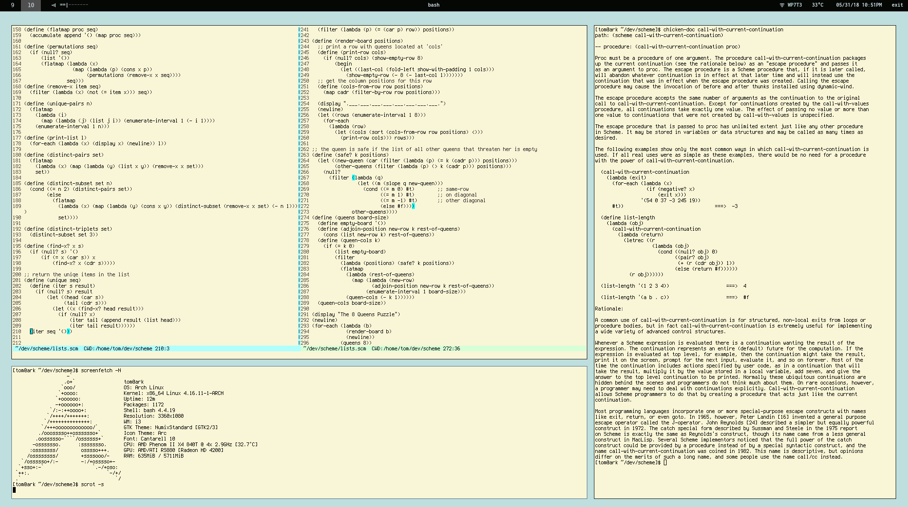

# My .dotfiles
## Screenshots

### Setup 1: valhalla

### Setup 2: ACME

## List of Programs and Software used
### Operating System
* [ArchLinux](https://www.archlinux.org) - however, these files _should_ work for most Unix like systems
### Shells
* Bash
* [Fish shell](https://fishshell.com/)
* [Oh My! Zsh](http://ohmyz.sh/)
### Terminal Emulators
* [st - simple terminal](https://st.suckless.org/)
* [termite](https://github.com/thestinger/termite)
* [urxvt](https://wiki.archlinux.org/index.php/rxvt-unicode)
### Editors
* [emacs](https://www.gnu.org/software/emacs/)
* [kakoune](http://kakoune.org/) - selection-based modal editor
* [vim](https://www.vim.org/)
* [vis](https://github.com/martanne/vis)
### File Managers
* [ranger](https://ranger.github.io/) - a console file manager with VI key bindings
### Window Manager, and related
* [i3](https://i3wm.org/)
* [i3-gaps](https://github.com/Airblader/i3)
* [polybar](https://github.com/jaagr/polybar)
### Fonts (for use with Polybar)
* [Inconsolata](https://www.archlinux.org/packages/community/any/ttf-inconsolata/)
* [siji](https://aur.archlinux.org/packages/siji-git/)
* [ttf-unifont](https://aur.archlinux.org/packages/ttf-unifont/)
### etc.
* [feh](https://feh.finalrewind.org/) - used to set the desktop background
* [pywal](https://github.com/dylanaraps/pywal) - used for generating colorschemes from an image
* [qutebrowser](https://www.qutebrowser.org/)
